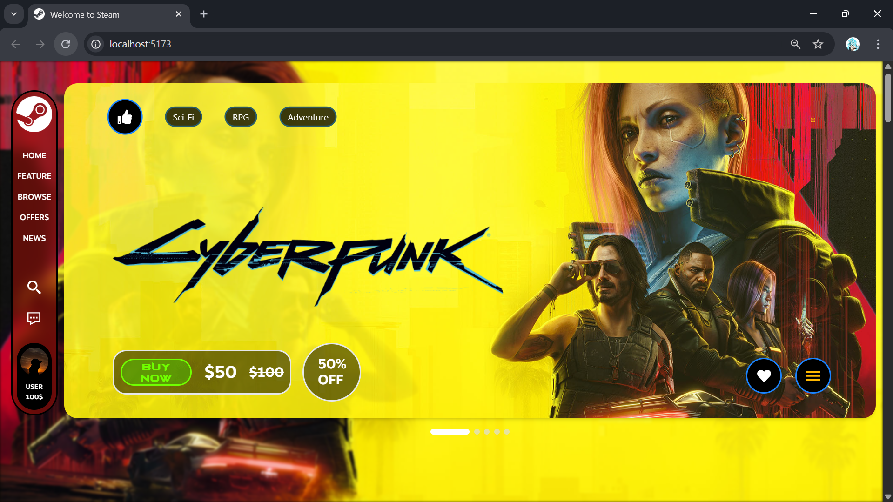
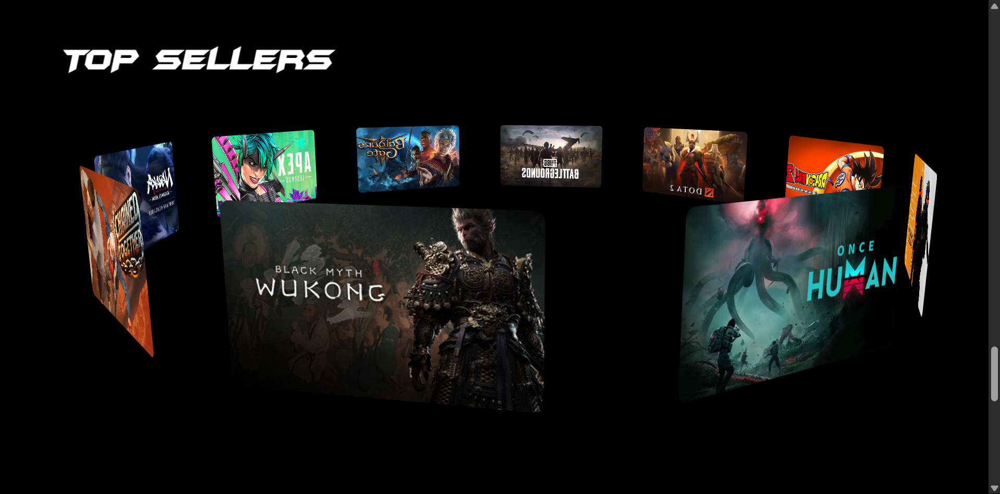
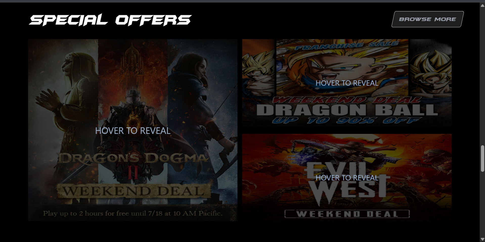
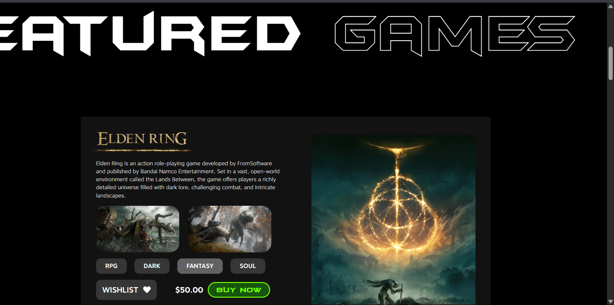

# 🎮 Steam Reimagined — Modern Redesign with React & GSAP

A fresh visual take on the Steam website using modern tools like **React**, **Tailwind CSS**, and **GSAP**. Designed for **fluidity**, **performance**, and **immersive interaction**, this redesign brings the Steam experience into 2024.

---

## 🌟 Highlights

🎯 **Complete UI Overhaul**
A custom-built React layout that reimagines Steam’s interface with a clean and modern design language.

🎞️ **Smooth Motion & Interactivity**
Leveraged GSAP for page transitions, carousel animations, and section reveals — making browsing more engaging.

📱 **Fully Responsive Design**
Built with Tailwind CSS for fluid layouts across all devices — from desktop to handheld.

⚡ **Optimized Performance**
Lazy loading, clean component architecture, and efficient image handling ensure fast navigation and smooth interactions.

🕹️ **Interactive Carousels & Sections**
Dynamic game showcases, hover effects, and scroll-activated sections for a richer user journey.

---

## 🧰 Tech Stack

| Layer     | Tools & Frameworks               |
| --------- | -------------------------------- |
| Frontend  | ReactJS, Tailwind CSS            |
| Animation | GSAP (GreenSock Animation)       |
| Assets    | Custom graphics & Steam branding |

---

## 🔗 Explore It

* 🔴 **Live Demo:** [View Demo](https://your-steam-demo-link.com)

---

## 📸 Visual Preview

| Section             | Snapshot                                |
| ------------------- | --------------------------------------- |
| 🎮 Homepage         |          |
| 🧩 Game Carousel    |  |
| 🕹️ Animated Cards  |        |
| 🖥️ Responsive View |  |

---

## 🧠 Why This Redesign?

Steam's current design, though functional, hasn’t evolved much visually. This project brings a **modernized aesthetic**, **motion-enhanced flow**, and **mobile-first usability** to better align with today’s UX expectations.

---

## 💬 Let’s Collaborate

Have feedback or ideas? Want help building something similar?

Connect with me on [LinkedIn](https://linkedin.com/in/your-profile)
📧 Email: `your.email@example.com`

